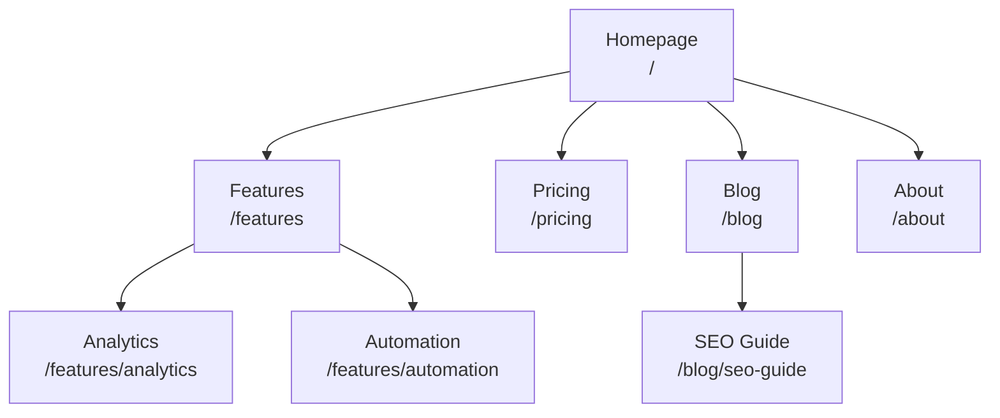
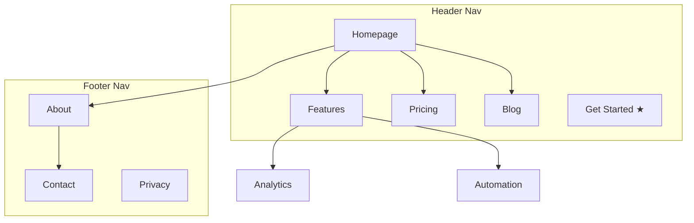
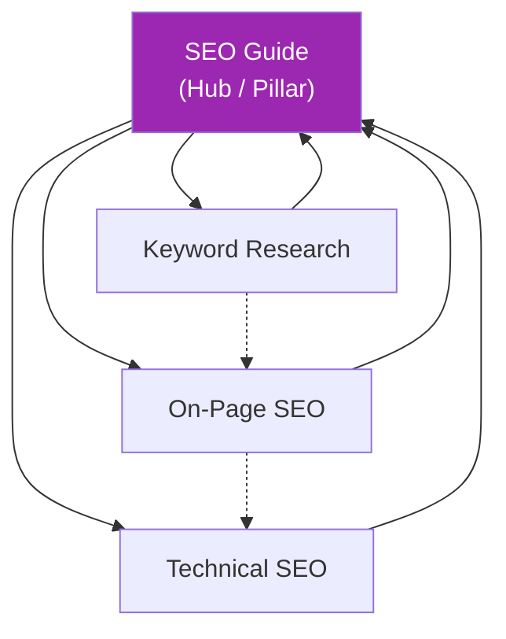
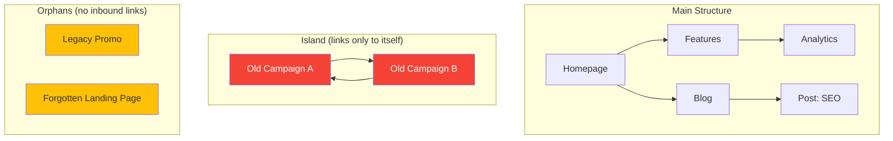
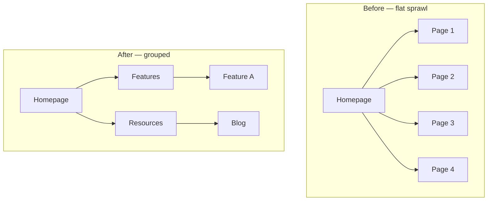
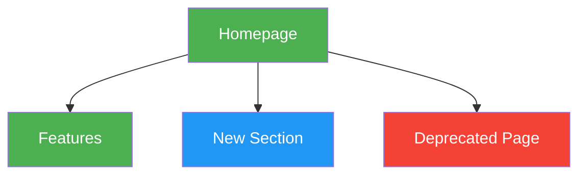

# Mermaid Site-Map Templates

Copy-paste-ready Mermaid diagrams for visual sitemaps. Customize node labels and connections. Paste into any Mermaid renderer.

---

## Basic Hierarchy

---

## Hierarchy with Navigation Zones

Subgraphs show which pages appear in which navigation area.

---

## Hub-and-Spoke Content Model

Hub page connected to spokes; spokes cross-link and link back to the hub.

Legend: solid = hub↔spoke links; dashed = cross-links between spokes.

---

## Orphans and Islands (the diagnostic view)

This is the map that earns the skill its keep. Put orphans (no inbound edges) in their own subgraph. An **island** is a cluster that links among its own members but never back to a pillar — mark it red.

Color key: **red** = island (reconnect to a pillar or retire); **yellow** = orphan (add inbound links, noindex, or 301).

---

## Before/After Restructuring

---

## Color-Coding Conventions

Key: **green** = existing (no change); **blue** = new page to create; **red** = remove/redirect; **yellow** = orphan/restructure; **purple** = hub or CTA.
